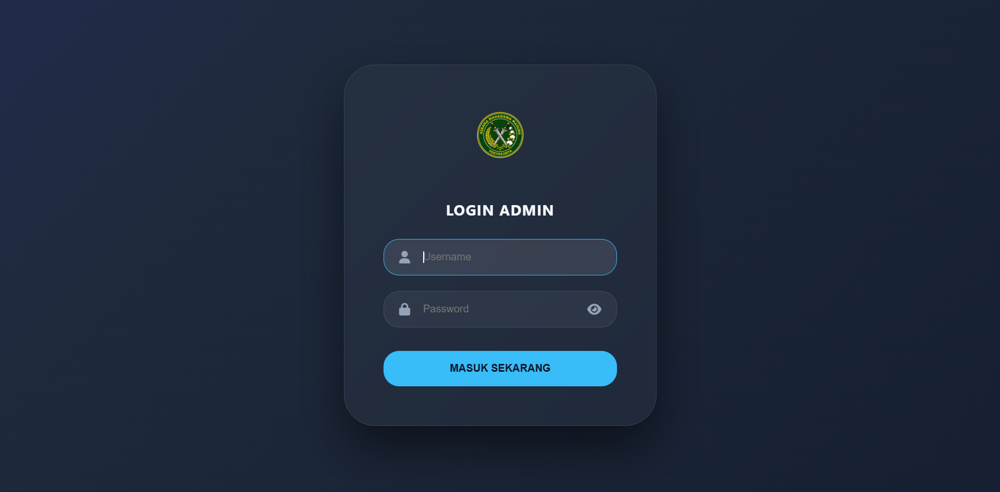
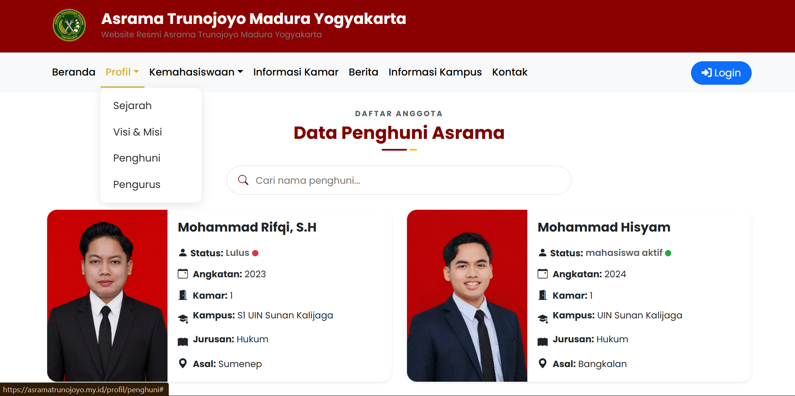
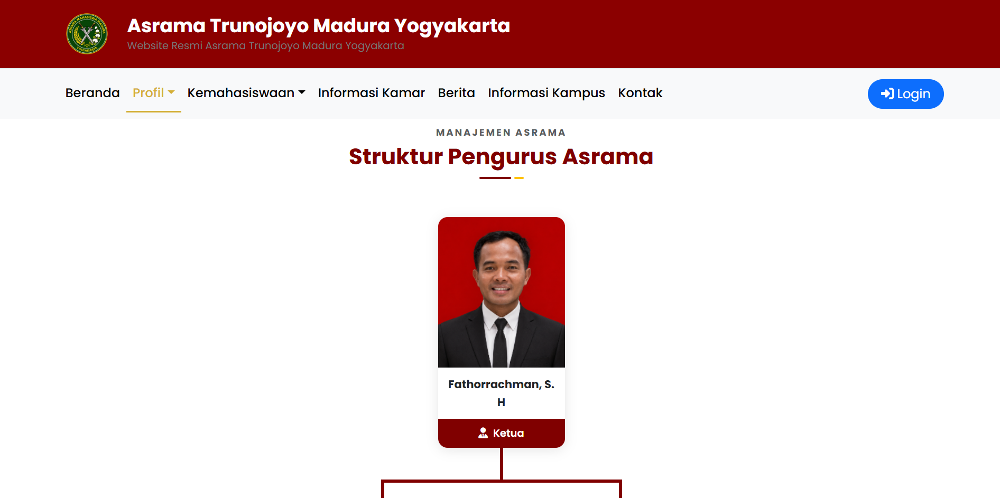
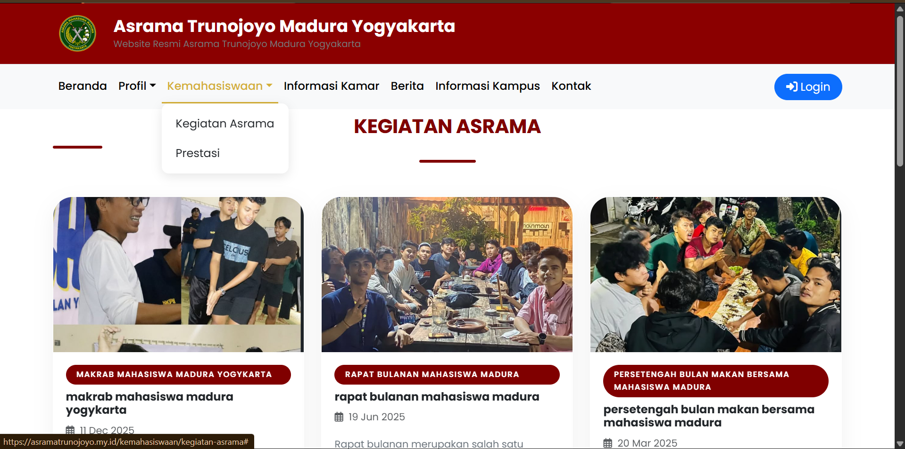
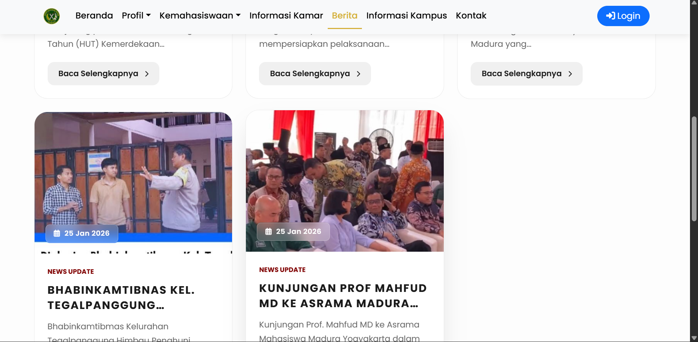

# Sistem Informasi Manajemen Asrama Mahasiswa Trunojoyo Madura

Sistem Informasi Manajemen Asrama Mahasiswa Trunojoyo Madura merupakan aplikasi berbasis web yang digunakan untuk membantu proses pengelolaan data dan informasi asrama secara lebih terstruktur.

Project ini dikembangkan menggunakan framework **CodeIgniter 4** dan database **MySQL**.

---

## Preview Aplikasi

### Halaman Login Admin


### Dashboard Admin
.png)

### Data Penghuni Asrama


### Struktur Pengurus Asrama


### Kegiatan Asrama


### Berita Asrama


---

## Fitur Utama

- Login admin
- Dashboard admin
- Manajemen data penghuni
- Manajemen data pengurus
- Manajemen kamar
- Manajemen kegiatan asrama
- Manajemen prestasi
- Manajemen berita
- Informasi kampus
- Informasi kamar
- Profil asrama
- Pencarian data penghuni
- Logout

---

## Teknologi yang Digunakan

- PHP
- CodeIgniter 4
- MySQL
- HTML
- CSS
- JavaScript
- Bootstrap

---

## Struktur Project

```text
asramamadura/
├── app/
├── public/
├── system/
├── tests/
├── writable/
├── docs/
│   └── images/
│       ├── login-admin.png
│       ├── dashboard-admin(1).png
│       ├── data-penghuni.png
│       ├── struktur-pengurus.png
│       ├── kegiatan-asrama.png
│       └── berita-asrama.png
├── asramamadura.sql
├── composer.json
├── README.md
└── spark
